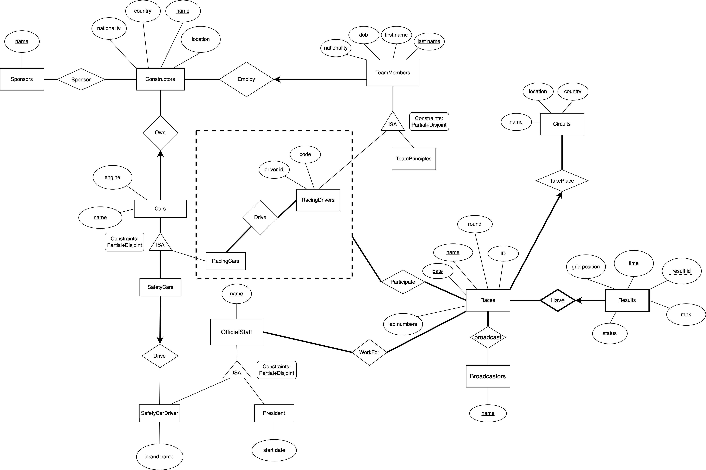

# Milestone #1 Proposal

We decided to model and build a database application in the domain of auto racing, targeting one
of the most infamous international racing events: Formula 1 (F1). 

In this project, we will model the aspects of F1, including races (specifically arranged for F1), 
circuits (the location where a race takes place), constructors (i.e. the racing teams), team members 
(i.e. racing drivers and team principles) and cars (e.g. racing cars and the safety car). Moreover, 
we will also store additional information such as F1 official staff, sponsors and broadcasters. 
For detailed relations among the involved entities, please refer to the attached ER diagram. Our 
potential users for this database system vary from audiences, drivers, referees, and sponsors. The use 
of this system is mainly for research purposes. For example, F1 team owners can refer to this database 
and come up with customized strategies for future seasons to achieve better racing results. Potential 
sponsors (companies) can use this database to decide which constructors to invest in. Users can only 
access data in this system including searching, browsing and downloading data for their use.

Our database can provide the following functionalities: Users can search in and download data
from our database with respect to races, drivers, etc., with the user-provided keywords. For example, 
users can search by the driver's name, and our database will provide related information like the 
specified driver’s car and his racing results. Users can also register their own accounts approved by 
admins in our system , which ensures database security. Administrators can manipulate the system by 
updating, deleting, and modifying the database. 

Our project will be done using the CS department’s Oracle database system and PHP. We do not anticipate 
using any other special software or hardware.

